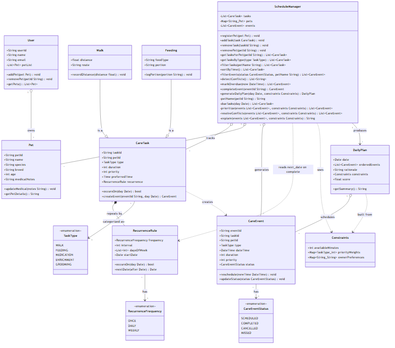

# PawPal+ (Module 2 Project)

You are building **PawPal+**, a Streamlit app that helps a pet owner plan care tasks for their pet.

## Scenario

A busy pet owner needs help staying consistent with pet care. They want an assistant that can:

- Track pet care tasks (walks, feeding, meds, enrichment, grooming, etc.)
- Consider constraints (time available, priority, owner preferences)
- Produce a daily plan and explain why it chose that plan

Your job is to design the system first (UML), then implement the logic in Python, then connect it to the Streamlit UI.

## What you will build

Your final app should:

- Let a user enter basic owner + pet info
- Let a user add/edit tasks (duration + priority at minimum)
- Generate a daily schedule/plan based on constraints and priorities
- Display the plan clearly (and ideally explain the reasoning)
- Include tests for the most important scheduling behaviors

## Getting started

### Setup

```bash
python -m venv .venv
source .venv/bin/activate  # Windows: .venv\Scripts\activate
pip install -r requirements.txt
```

### Suggested workflow

1. Read the scenario carefully and identify requirements and edge cases.
2. Draft a UML diagram (classes, attributes, methods, relationships).
3. Convert UML into Python class stubs (no logic yet).
4. Implement scheduling logic in small increments.
5. Add tests to verify key behaviors.
6. Connect your logic to the Streamlit UI in `app.py`.
7. Refine UML so it matches what you actually built.

## ✨ Features

PawPal+ implements the following algorithms, all in
[`pawpal_system.py`](pawpal_system.py):

- **Sorting by time of day** — `ScheduleManager.sort_by_time()` orders the task
  wishlist earliest-first with a single `O(n log n)` sort. A composite
  `(preferred_time is None, "HH:MM")` key pushes "anytime" tasks to the end and
  relies on zero-padded strings so lexicographic order equals chronological
  order. Non-mutating (returns a new list).
- **Priority-weighted planning** — `_prioritize()` ranks events by
  `priority × type-weight`, then applies owner-preference boosts/penalties
  (±100), sorting highest-weight first with ties broken by earlier time.
- **Greedy, budget-aware scheduling** — `_resolve_conflicts()` fills the day
  greedily in priority order, skipping any event that would exceed the
  `available_minutes` budget or overlap an already-kept event.
- **Conflict warnings** — `detect_conflicts()` sorts timed tasks by start
  minute, then forward-scans with an early break, making it output-sensitive
  (near-linear when few tasks overlap). Emits one human-readable warning per
  overlapping pair, flagged as *same pet* vs *different pets*; "anytime" tasks
  are skipped.
- **Overdue detection** — `mark_overdue(now)` does one `O(n)` pass, flipping any
  still-`SCHEDULED` event whose end (`start + duration`) is before `now` to
  `MISSED`, and returns the changed events.
- **Recurrence rules** — `RecurrenceRule.occurs_on()` / `next_date()` support
  **once**, **daily** (jump `interval` days), and **weekly** (scan the next 7
  days for a configured weekday, or jump `interval` weeks). Date math uses
  `timedelta` for calendar-accurate month/year rollover.
- **Recurrence-aware completion** — `complete_event()` marks an event
  `COMPLETED` and auto-spawns the next occurrence for recurring tasks. It is
  idempotent (a duplicate-id guard prevents double-spawning) and one-time
  (`ONCE`) tasks spawn nothing.
- **Filtering** — `filter_tasks()` filters the wishlist by pet
  (case-insensitive); `filter_events()` filters the live schedule by completion
  status and/or pet, combined with AND.
- **Explained, scored plans** — `_explain()` produces the human-readable
  rationale, and each `DailyPlan` carries a `score` = scheduled ÷ due tasks.

## 🗺️ System Design (UML)

The class diagram below reflects the **final, as-built** system. The Mermaid
source lives at [`diagrams/uml_final.mmd`](diagrams/uml_final.mmd) (an earlier
design draft is preserved at [`diagrams/uml_draft.mmd`](diagrams/uml_draft.mmd)).



Key additions made during the build, beyond the original draft:

- **`RecurrenceRule.next_date()`** — computes the next firing date, powering
  recurring-task auto-scheduling.
- **`ScheduleManager`** grew the querying/planning helpers the UI relies on:
  `sort_by_time()`, `filter_tasks()`, `filter_events()`, `detect_conflicts()`,
  `mark_overdue()`, and `complete_event()`.

## 🖥️ Sample Output

Paste a sample of your app's CLI or Streamlit output here so a reader can see what a generated plan looks like:

```
Alice has 2 pets:
  - Buddy (Dog, Labrador), age 4. Medical notes: none
  - Whiskers (Cat, Tabby), age 2. Medical notes: none

All Registered Tasks for Today:
  - [WALK] for Buddy at 08:00 (30 min, Priority: 2)
  - [FEEDING] for Whiskers at 13:00 (15 min, Priority: 5)
  - [GROOMING] for Buddy at 19:00 (20 min, Priority: 1)

Daily plan for 2026-06-27:
  1. 13:00 - feeding (15 min)
  2. 08:00 - walk (30 min)

Reasoning: Scheduled 2 task(s) using 45 of 60 available minutes, ordered by priority.
- feeding at 13:00 (15 min, priority 5 x weight 1)
- walk at 08:00 (30 min, priority 2 x weight 1)

Plan score (fraction of due tasks scheduled): 0.67

```

## 🧪 Testing PawPal+

```bash
# Run the full test suite:
pytest

# Run with coverage:
pytest --cov
```

Sample test output:

```
=================================================== test session starts ====================================================
platform win32 -- Python 3.14.5, pytest-9.1.1, pluggy-1.6.0
rootdir: C:\Users\victo\Downloads\AI110-Codepath\pawpal-starter
collected 10 items                                                                                                           

tests\test_pawpal.py ..                                                                                               [ 20%]
tests\test_schedule_manager.py ........                                                                                [100%]

==================================================== 10 passed in 0.06s ====================================================
```       
### Test Coverage Summary       
The test suite verifies the core backend behaviors of the pet scheduler application across both happy paths and tricky edge cases. Specifically, it validates that active tasks are successfully sorted into their chronological or strict priority order, ensures recurring tasks accurately transition and handle calculation logic across day changes, and checks that the system properly flags time budget or overlapping event constraints. It also confirms stable and robust performance under boundary conditions, such as when processing empty profiles or matching identical task schedules.           

### Confidence Level
⭐ ⭐ ⭐ ⭐ ⭐ (5/5 Stars)      
**Rationale:** The system successfully passed all 10 unit tests focusing on robust priority routing, time conflict detection, and complex edge cases without a single failure or regression. 


## 📐 Smarter Scheduling

Beyond the basic daily plan, PawPal+ implements four "smarter scheduling"
behaviors. All of them live on `ScheduleManager` (and `RecurrenceRule`) in
`pawpal_system.py`.

| Feature | Method(s) | Notes |
|---------|-----------|-------|
| Sorting | `ScheduleManager.sort_by_time()` | Orders the task wishlist by time of day, earliest first; "anytime" tasks last |
| Filtering | `ScheduleManager.filter_tasks()`, `ScheduleManager.filter_events()` | Filter the wishlist by pet, and the live schedule by pet and/or completion status |
| Conflict detection | `ScheduleManager.detect_conflicts()` | Non-fatal warnings for overlapping time windows (same pet or different pets) |
| Recurring tasks | `RecurrenceRule.next_date()`, `ScheduleManager.complete_event()` | Completing a daily/weekly task auto-creates the next occurrence |
                     
The system coordinates these core behaviors to seamlessly organize pet care routines: Sorting arranges tasks chronologically by preferred time while gracefully pushing "anytime" items to the end; Filtering allows users to isolate tasks by pet or active schedule events by their completion status; Conflict detection non-fatally scans overlapping time windows to output actionable, human-readable warnings for multi-pet management; and Recurring tasks utilize precise datetime calculations to automatically generate subsequent events the moment an existing recurring task is marked complete.                            


## 📸 Demo Walkthrough            
                        
Describe your app in numbered steps so a reader can follow along without watching a video: 

1. **Add your pet:** Type a name in the **Pet name** field (e.g., `Buddy`),
   select a **Species**, then click **Add task** to register the pet in the
   manager.
2. **Add a care task:** Choose a **Task type** (e.g., `Walk`), set the
   **Duration** and **Priority**, pick a **Preferred time** (e.g., `08:00`), and
   click **Add task**.
3. **Add a clashing task:** Add another task at an overlapping time (e.g.,
   `Feeding` at `08:00`) and watch the **conflict warning** appear below the
   wishlist table.
4. **View today's tasks:** Scroll to the **Current tasks** table to see every
   task automatically **sorted by time of day**.
5. **Generate the schedule:** Set **Available minutes today** (e.g., `60`) and
   click **Generate schedule** to get a prioritized, conflict-resolved plan, its
   score, and the **Today's status** breakdown.


### Sample CLI output (`python main.py`)

The `main.py` demo script exercises the same backend without the UI:

```text
Alice has 2 pets:
  - Buddy (Dog, Labrador), age 4. Medical notes: none
  - Whiskers (Cat, Tabby), age 2. Medical notes: none

All Registered Tasks (insertion order):
  - [GROOMING] for Buddy at 19:00 (20 min, Priority: 1)
  - [WALK] for Buddy at 08:00 (30 min, Priority: 2)
  - [FEEDING] for Whiskers at 13:00 (15 min, Priority: 5)
  - [FEEDING] for Whiskers at 08:00 (10 min, Priority: 4)

Tasks sorted by time (sort_by_time):
  - [WALK] for Buddy at 08:00 (30 min, Priority: 2)
  - [FEEDING] for Whiskers at 08:00 (10 min, Priority: 4)
  - [FEEDING] for Whiskers at 13:00 (15 min, Priority: 5)
  - [GROOMING] for Buddy at 19:00 (20 min, Priority: 1)

Wishlist filtered to Buddy (filter_tasks):
  - [GROOMING] for Buddy at 19:00 (20 min, Priority: 1)
  - [WALK] for Buddy at 08:00 (30 min, Priority: 2)

Detected 1 scheduling conflict(s):
  [CONFLICT] (different pets) walk for Buddy at 08:00 overlaps feeding for Whiskers at 08:00.

Daily plan for 2026-07-03:
  1. 13:00 - feeding (15 min)
  2. 08:00 - feeding (10 min)
  3. 19:00 - grooming (20 min)

Reasoning: Scheduled 3 task(s) using 45 of 60 available minutes, ordered by priority.
- feeding at 13:00 (15 min, priority 5 x weight 1)
- feeding at 08:00 (10 min, priority 4 x weight 1)
- grooming at 19:00 (20 min, priority 1 x weight 1)

Plan score (fraction of due tasks scheduled): 0.75

mark_overdue(14:00) flipped 2 task(s) to MISSED.

Live schedule by status (filter_events):
  scheduled: grooming
  completed: (none)
     missed: feeding, feeding

Completing today's daily grooming...
  -> Auto-created next occurrence: grooming on 2026-07-04 at 19:00 (status: scheduled)
  Today was 2026-07-03; next grooming is exactly one day later.
```
